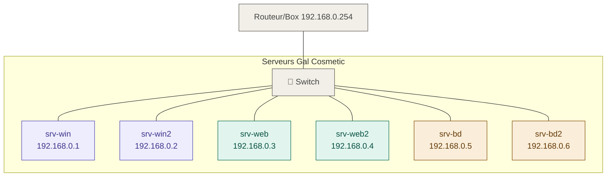

# `🌐` ︲ Documentation TP : Installer et configurer un service DNS

Ce dépôt présente une documentation technique détaillée sur la mise en place d'un serveur DNS sur Windows Server 2022 : configuration des zones de recherche directe et inversée, création d'enregistrements d'hôtes (A), d'alias (CNAME) et mise en place de la redondance avec un serveur DNS secondaire.

---

## 📑 ︲ Sommaire

- [📘 ︲ Introduction](#introduction)
  - [❔ ︲ Contexte et objectifs](#contexte)
  - [🧰 ︲ Présentation des outils](#outils)
- [🧩 ︲ Mission 1 : Préparer le serveur Windows](#mission1)
- [🧩 ︲ Mission 2 : Préparer le serveur Web](#mission2)
- [🧩 ︲ Mission 3 : Tester le fonctionnement du serveur Web](#mission3)
- [🧩 ︲ Mission 4 : Configurer le service DNS](#mission4)

---

# `📘` ︲ Introduction

---

## `❔` ︲ Contexte et objectifs du TP

> [!NOTE]
> **Ce TP fait suite à la mise en place du service DHCP pour l'entreprise Gal Cosmetic.** L'objectif est désormais de mettre en place le service DNS (Domain Name System) afin de permettre la résolution de noms au sein du réseau local. Cela inclut la création de zones directe et inversée, d'enregistrements d'hôtes, d'alias (CNAME), ainsi que la mise en place d'un serveur DNS secondaire pour assurer la redondance.

---

## `🧰` ︲ Présentation des outils et prérequis

> [!IMPORTANT]
> **Présentation des outils et prérequis :**
>
> - `🖥️` ︱ **Serveur principal :** Windows Server 2022 — `srv-win` — `192.168.0.1`
> - `🖥️` ︱ **Serveur secondaire :** Windows Server 2022 — `srv-win2` — `192.168.0.2`
> - `🌍` ︱ **Serveur Web 1 :** Linux/Apache — `srv-web` — `192.168.0.3`
> - `🌍` ︱ **Serveur Web 2 :** Linux/Apache — `srv-web2` — `192.168.0.4`
> - `🗄️` ︱ **Serveur BDD 1 :** `srv-bd` — `192.168.0.5`
> - `🗄️` ︱ **Serveur BDD 2 :** `srv-bd2` — `192.168.0.6`
> - `💻` ︱ **Client :** Windows 11
> - `🛠️` ︱ **Outil réseau :** Wireshark
> - `🖼️` ︱ **Virtualisation :** Hyperviseur de Type 2 (mode Réseau Interne)

### Schéma réseau


---

# `🧩` ︲ Mission 1 : Préparer le serveur Windows

## `🎯` ︲ Objectif

Renommer le serveur, installer le rôle DNS et configurer le serveur pour qu'il utilise sa propre adresse IP comme serveur DNS.

> [!TIP]
> Pour afficher les captures d'écrans, cliquez sur le menu déroulant avec l'émoji : 📸

## `🛠️` ︲ Étape 1 : Renommer le serveur

1. Ouvrir le `Gestionnaire de serveur` si celui ci ne l'est pas déjà.
2. Aller dans `Serveur local`.
3. Cliquer sur le nom actuel du serveur.
4. Dans l'onglet `Nom de l'ordinateur`, cliquer sur `Modifier`.
5. Saisir le nouveau nom : `srv-win`.
6. Redémarrer le serveur pour appliquer le changement.

<details>
  <summary><strong>📸︲Renommage du serveur</strong></summary>
  
</details>

## `🛠️` ︲ Étape 2 : Installer le rôle DNS

1. Se rendre dans le `Gestionnaire de serveur`.
2. Cliquer sur `Gérer` puis `Ajouter des rôles et fonctionnalités`.
3. Sélectionner `Installation basée sur un rôle ou une fonctionnalité`.
4. Choisir le `serveur local`.
5. Cocher le rôle `Serveur DNS`.
6. `Valider` et lancer l'installation.

<details>
  <summary><strong>📸︲Installation du rôle DNS</strong></summary>
  
  <br>
  
</details>

## `🛠️` ︲ Étape 3 : Configurer l'adresse IP du serveur DNS

Dans la configuration réseau du serveur, il faut indiquer `sa propre adresse IP` comme **serveur DNS préféré** :

Pour ce faire, 
1. Dans le `Gestionnaire de serveur` puis cliquer sur l'onglet `Serveur local` dans le menu gauche.
1. Cliquer sur `l'IP`.
2. Dans la nouvelle fenêtre qui s'affiche `double cliquer` sur la carte `Ethernet`, puis `Protocole Internet version 4`.
3. Dans la partie `Utiliser l'addresse de serveur DNS suivante :` saisir `192.168.0.1` dans `Serveur DNS préféré`. 

<details>
  <summary><strong>📸︲Configuration DNS</strong></summary>
  
</details>

## `🛠️` ︲ Étape 4 : Ajouter l'option DNS dans le service DHCP

Afin que les clients reçoivent automatiquement l'adresse du serveur DNS :

1. Ouvrir la console `DHCP`, pour ce faire dans le `Gestionnaire de Serveur` cliquer sur `Outils` puis `DHCP`.
2. Aller dans `win-srv` → `IPv4` → `Étendue [192.168.0.0] Réseau local` puis `Options d'étendue`.
3. `Clic droit` et `Configurer les options`.
4. Cocher l'option `006 - Serveurs DNS`.
5. `Ajouter` l'adresse IP : `192.168.0.1` puis valider.

<details>
  <summary><strong>📸︲Installation du Service DNS</strong></summary>
  
  <br>
  
  <br>
  
  <br>
  
</details>

## `🛠️` ︲ Étape 5 : Vérification côté client

Sur le client Windows 11 :

1. Ouvrir une `Invite de commandes`.
2. Renouveler l'adresse IP :

```bash
ipconfig /release
```
et 
```bash
ipconfig /renew
```

3. Vérifier que le serveur DNS est bien `192.168.0.1` avec la commande:

```bash
ipconfig /all
```

<details>
  <summary><strong>📸︲Vérification</strong></summary>
  
</details>

---

# `🧩` ︲ Mission 2 : Préparer le serveur Web

## `🎯` ︲ Objectif

Démarrer le serveur Web et lui attribuer une adresse IP statique conforme au schéma réseau.

---

## `🛠️` ︲ Procédure

1. **Démarrer** la VM `srv-web`.
2. Identifier son adresse IP actuelle (attribuée dynamiquement par le DHCP) :

```
ip a
```


3. **Modifier l'adressage** pour passer en IP statique :

| Paramètre  | Valeur          |
| ---------- | --------------- |
| Adresse IP | `192.168.0.3`   |
| Masque     | `255.255.255.0` |
| DNS        | `192.168.0.1`   |

Pour ce faire :

```bash
sudo nano /etc/network/interfaces
```

Observer la ligne `iface eth0 inet dhcp` puis remplacer et ajouter :

```bash
iface eth0 inet static
address 192.168.0.3
netmask 255.255.255.0
dns-nameservers 192.168.0.1
```
Puis redémarrer avec :
```
sudo reboot
```
<details>
  <summary><strong>📸︲Identification de l'IP</strong></summary>
  
</details>

<details>
  <summary><strong>📸︲Configuration IP statique du serveur Web</strong></summary>
  
  <br>
  
</details>

---

# `🧩` ︲ Mission 3 : Tester le fonctionnement du serveur Web

## `🎯` ︲ Objectif

Vérifier la communication entre le client et le serveur Web, et observer le comportement du DNS via Wireshark.

---

## `🛠️` ︲ Étape 1 : Test de ping

Depuis le client Windows 11, exécuter :

```bash
ping 192.168.0.3
```

Le ping doit aboutir, confirmant la communication réseau entre les deux machines.

<details>
  <summary><strong>📸︲Ping vers le serveur Web</strong></summary>
  
</details>

---

## `🛠️` ︲ Étape 2 : Accès via navigateur (par IP)

Sur le client, ouvrir un navigateur et saisir :

```
http://192.168.0.3
```

👉 La page d'accueil du serveur Web doit s'afficher.

<details>
  <summary><strong>📸︲Page d'accueil du serveur Web (accès par IP)</strong></summary>
  
</details>

---

## `🛠️` ︲ Étape 3 : Capture Wireshark sur le port 53

1. Ouvrir **Wireshark** sur le client Windows 11.
2. Démarrer une capture sur l'interface **Ethernet** avec le filtre :

```
port 53
```

3. Dans un navigateur, accéder à :

```
http://srv-web.galcosmetic.fr
```

4. Stopper la capture et repérer la première trame **DNS query**.
5. Observer le champ **Domain Name System**.
6. Faire un `clic droit` sur l'attribut **Transaction ID** → `Appliquer comme un filtre` → `Sélectionné`.

### Analyse des trames DNS

| Trame            | Rôle                                                            |
| ---------------- | --------------------------------------------------------------- |
| **DNS Query**    | Le client demande l'IP correspondant à `srv-web.galcosmetic.fr` |
| **DNS Response** | Le serveur DNS répond avec l'adresse IP `192.168.0.3`           |

> [!NOTE]
> **Le port 53** est le port standard utilisé par le protocole DNS pour la résolution de noms de domaine (en UDP pour les requêtes classiques, en TCP pour les transferts de zone).

<details>
  <summary><strong>📸︲Capture Wireshark port 53</strong></summary>
  
  <br>
  
  <br>
  
  <br>
  
  <br>
  
</details>

---

# `🧩` ︲ Mission 4 : Configurer le service DNS


## `🎯` ︲ Objectif

Créer les zones de recherche directe et inversée pour le domaine `galcosmetic.fr`.

---

## `🛠️` ︲ Étape 1 : Créer la zone de recherche directe

1. Ouvrir le `Gestionnaire de serveur` puis `Outils` et `DNS`.
2. `Clic droit` sur `Zones de recherche directes` puis `Nouvelle zone`.
3. Choisir `Zone principale`.
4. Saisir le nom de zone : `galcosmetic.fr`
5. Laisser l'option de `création automatique du fichier de zone` cochée.
6. `Terminer` l'assistant.

<details>
  <summary><strong>📸︲Création de la zone de recherche directe</strong></summary>
  
  <br>
  
  <br>
  
  <br>
  
</details>

---

## `🛠️` ︲ Étape 2 : Créer la zone de recherche inversée

1. `Clic droit` sur **`Zones de recherche inversées`** → **`Nouvelle zone`**.
2. Choisir **`Zone principale`**.
3. Saisir l'**ID réseau** : `192.168.0`
4. Laisser l'option de **création automatique du fichier de zone** cochée.
5. **Terminer** l'assistant.

<details>
  <summary><strong>📸︲Création de la zone de recherche inversée</strong></summary>
  
  <br>
  
  <br>
  
  <br>
  
  <br>
  
  <br>
  
</details>

---

# `🧩` ︲ Mission 5 : Créer des hôtes et tester leur fonctionnement

---

## `🎯` ︲ Objectif

Créer des enregistrements A (hôtes) pour les serveurs Web et tester la résolution de noms.

---

## `🛠️` ︲ Étape 1 : Créer les enregistrements d'hôtes

1. Dans le Gestionnaire DNS, développer **`Zones de recherche directes`** → **`galcosmetic.fr`**.
2. `Clic droit` dans la zone → **`Nouvel hôte (A ou AAAA)`**.
3. Créer les deux hôtes suivants :

| Nom        | Adresse IP    | PTR      |
| ---------- | ------------- | -------- |
| `srv-web`  | `192.168.0.3` | ✅ Cocher |
| `srv-web2` | `192.168.0.4` | ✅ Cocher |

> [!IMPORTANT]
> L'option **« Mettre à jour l'enregistrement de pointeur (PTR) associé »** doit être cochée afin de créer automatiquement l'enregistrement PTR dans la zone inversée.

<details>
  <summary><strong>📸︲Création des enregistrements hôtes</strong></summary>
  
</details>

---

## `🛠️` ︲ Étape 2 : Test nslookup depuis le serveur

Sur le serveur Windows (`srv-win`), ouvrir une Invite de commandes :

```
nslookup srv-web.galcosmetic.fr
```

**Résultat attendu :**

```
Serveur : srv-win.galcosmetic.fr
Address : 192.168.0.1

Nom : srv-web.galcosmetic.fr
Address : 192.168.0.3
```

👉 Le serveur DNS résout correctement le FQDN vers l'adresse IP `192.168.0.3`.

<details>
  <summary><strong>📸︲nslookup depuis le serveur</strong></summary>
  
</details>

---

## `🛠️` ︲ Étape 3 : Test nslookup depuis le client

Sur le client Windows 11, effectuer le même test :

```
nslookup srv-web.galcosmetic.fr
```

👉 Le client interroge le serveur DNS `192.168.0.1` et obtient la même réponse.

<details>
  <summary><strong>📸︲nslookup depuis le client</strong></summary>
  
</details>

---

## `🛠️` ︲ Étape 4 : Capture Wireshark — accès par FQDN

1. Démarrer une capture Wireshark avec le filtre `port 53`.
2. Dans un navigateur, accéder à : `http://srv-web.galcosmetic.fr`
3. Stopper la capture et filtrer par **Transaction ID**.
4. Dans la **trame de réponse**, observer dans `Domain Name System → Answers` :

| Champ      | Valeur             |
| ---------- | ------------------ |
| Adresse IP | `192.168.0.3`      |
| Type       | `A` (adresse IPv4) |
| Classe     | `IN` (Internet)    |

<details>
  <summary><strong>📸︲Capture Wireshark — réponse DNS</strong></summary>
  
</details>

---

## `🛠️` ︲ Étape 5 : Ping par nom

```
ping srv-web.galcosmetic.fr
```

👉 La réponse est obtenue grâce à l'**enregistrement A** créé dans la zone de recherche directe.

---

## `🛠️` ︲ Étape 6 : Ping inverse with the option `-a`

```
ping -a 192.168.0.3
```

👉 La réponse est obtenue grâce à l'**enregistrement PTR** créé dans la zone de recherche inversée.

> [!NOTE]
> L'option **`-a`** de la commande `ping` permet d'effectuer une **résolution DNS inverse** : à partir d'une adresse IP, elle retrouve et affiche le nom d'hôte (FQDN) correspondant.

<details>
  <summary><strong>📸︲Ping inverse `-a`</strong></summary>
  
</details>

---

# `🧩` ︲ Mission 6 : Créer des alias et tester leur fonctionnement

---

## `🎯` ︲ Objectif

Créer des enregistrements CNAME (alias) pointant vers le FQDN du serveur Web.

---

## `🛠️` ︲ Étape 1 : Créer les alias

1. Dans le Gestionnaire DNS, aller dans la zone `galcosmetic.fr`.
2. `Clic droit` → **`Nouvel alias (CNAME)`**.
3. Créer les deux alias suivants :

| Alias   | FQDN cible               |
| ------- | ------------------------ |
| `www`   | `srv-web.galcosmetic.fr` |
| `spike` | `srv-web.galcosmetic.fr` |

<details>
  <summary><strong>📸︲Création des alias CNAME</strong></summary>
  
</details>

---

## `🛠️` ︲ Étape 2 : Test depuis le navigateur avec Wireshark

1. Démarrer une capture Wireshark.
2. Accéder à `http://www.galcosmetic.fr` puis `http://spike.galcosmetic.fr`.
3. Dans la **trame de réponse**, observer le champ **Answers** :
   - Une première entrée de type **CNAME** pointant vers `srv-web.galcosmetic.fr`
   - Une deuxième entrée de type **A** avec l'adresse IP `192.168.0.3`

👉 Le serveur DNS résout d'abord l'alias vers son FQDN, puis le FQDN vers l'adresse IP.

<details>
  <summary><strong>📸︲Capture Wireshark — réponse CNAME</strong></summary>
  
</details>

---

# `🧩` ︲ Mission 7 : Observer le fichier de configuration DNS

---

## `🎯` ︲ Objectif

Analyser le fichier de zone DNS généré automatiquement par Windows Server.

---

## `🛠️` ︲ Procédure

Sur le serveur Windows, ouvrir avec le **Bloc-notes** :

```
C:\Windows\System32\dns\galcosmetic.fr.dns
```

### Structure du fichier de zone

```dns
; Zone version:  5

$ORIGIN galcosmetic.fr.
$TTL 3600

@   IN  SOA srv-win.galcosmetic.fr. hostmaster.galcosmetic.fr. (
            5            ; serial number
            900          ; refresh
            600          ; retry
            86400        ; expire
            3600 )       ; minimum TTL

; Zone NS records

@   NS  srv-win.galcosmetic.fr.

; Zone records

srv-win     A   192.168.0.1
srv-web     A   192.168.0.3
srv-web2    A   192.168.0.4
www         CNAME   srv-web.galcosmetic.fr.
spike       CNAME   srv-web.galcosmetic.fr.
```

### Explication des lignes

| Élément         | Signification                                                                              |
| --------------- | ------------------------------------------------------------------------------------------ |
| `$ORIGIN`       | Définit le domaine de base de la zone                                                      |
| `$TTL`          | Durée de vie par défaut des enregistrements (en secondes)                                  |
| `SOA`           | Start Of Authority — informations d'autorité de la zone (voir [Généralités](#generalites)) |
| `NS`            | Name Server — serveur DNS faisant autorité pour la zone                                    |
| `A`             | Enregistrement d'hôte IPv4 (nom → IP)                                                      |
| `CNAME`         | Alias pointant vers un autre nom (FQDN)                                                    |
| `serial number` | Numéro de version de la zone, incrémenté à chaque modification                             |
| `refresh`       | Délai (s) avant que le secondaire vérifie si la zone a changé                              |
| `retry`         | Délai (s) avant une nouvelle tentative si le refresh échoue                                |
| `expire`        | Durée (s) après laquelle le secondaire considère la zone invalide                          |
| `minimum TTL`   | TTL minimum applicable aux enregistrements négatifs                                        |

<details>
  <summary><strong>📸︲Fichier galcosmetic.fr.dns</strong></summary>
  
</details>

---

| 4   | `mit.edu`           | `host -t NS mit.edu`           | À compléter           |

---

## `🛠️` ︲ Adresses IP des domaines

| #   | Domaine         | Commande                  | Adresse IP  |
| --- | --------------- | ------------------------- | ----------- |
| 5   | `amazon.com`    | `host -t A amazon.com`    | À compléter |
| 6   | `fnac.fr`       | `host -t A fnac.fr`       | À compléter |
| 7   | `iut-tarbes.fr` | `host -t A iut-tarbes.fr` | À compléter |
| 8   | `debian.org`    | `host -t A debian.org`    | À compléter |

---

# `📖` ︲ Généralités et Concepts DNS

## `🔍` ︲ Rôles des zones Directe et Inversée

*   **Zone de recherche directe** : C'est le rôle principal du DNS. Elle permet de traduire un nom d'hôte (FQDN) en une adresse IP. Par exemple, lorsqu'un utilisateur saisit `srv-web.galcosmetic.fr`, le DNS interroge la zone directe pour renvoyer l'IP `192.168.0.3`.
*   **Zone de recherche inversée** : Elle effectue l'opération inverse en traduisant une adresse IP en un nom d'hôte. Elle est essentielle pour certains protocoles de sécurité, pour le diagnostic réseau (ex: `ping -a`) et pour éviter que les emails ne soient considérés comme spams.

## `🏷️` ︲ Signification des termes techniques

*   **SOA (Start Of Authority)** : L'enregistrement de "début d'autorité". Il s'agit de l'enregistrement le plus important d'une zone. Il désigne le serveur DNS principal qui détient les informations de la zone et contient des paramètres de gestion comme le numéro de série (utilisé pour la réplication vers les serveurs secondaires) et les durées de cache (TTL).
*   **NS (Name Server)** : Cet enregistrement liste les serveurs DNS qui font autorité pour le domaine. Il indique quel(s) serveur(s) possède(nt) les fichiers de zone et peuvent répondre aux requêtes concernant ce domaine.

---

**Esteban GUILLERMIN EGIDIO** | **BTS SIO SISR**