# `🌐` ︲ Documentation TP : Installer et configurer un service DNS

Ce dépôt présente une documentation technique détaillée sur la mise en place d'un serveur DNS sur Windows Server 2025 : configuration des zones de recherche directe et inversée, création d'enregistrements d'hôtes (A), d'alias (CNAME) et mise en place de la redondance avec un serveur DNS secondaire.

---

## 📑 ︲ Sommaire

- [📘 ︲ Introduction](#introduction)
  - [❔ ︲ Contexte et objectifs](#contexte)
  - [🧰 ︲ Présentation des outils](#outils)
- [🧩 ︲ Mission 1 : Préparer le serveur Windows](#mission1)
- [🧩 ︲ Mission 2 : Préparer le serveur Web](#mission2)
- [🧩 ︲ Mission 3 : Tester le fonctionnement du serveur Web](#mission3)
- [🧩 ︲ Mission 4 : Configurer le service DNS](#mission4)
- [🧩 ︲ Mission 5 : Créer des hôtes et tester leur fonctionnement](#mission5)
- [🧩 ︲ Mission 6 : Créer des alias (CNAME)](#mission6)
- [🧩 ︲ Mission 7 : Observer et analyser le fichier de configuration DNS](#mission7)
- [🧩 ︲ Mission 8 : Observer le référencement des serveurs racines](#mission8)
- [🧩 ︲ Mission 9 : Configurer un redirecteur DNS](#mission9)
- [🧩 ︲ Mission 11 : Louer un nom de domaine](#mission11)
- [🧩 ︲ Mission 12 : Identifier les adresses IP de serveurs](#mission12)
- [📖 ︲ Concepts DNS](#concepts-dns)

---

<a id="introduction"></a>
# `📘` ︲ Introduction

---

<a id="contexte"></a>
## `❔` ︲ Contexte et objectifs du TP

> [!NOTE]
> **Ce TP fait suite à la mise en place du service DHCP pour l'entreprise Gal Cosmetic.** L'objectif est désormais de mettre en place le service DNS (Domain Name System) afin de permettre la résolution de noms au sein du réseau local. Cela inclut la création de zones directe et inversée, d'enregistrements d'hôtes, d'alias (CNAME), ainsi que la mise en place d'un serveur DNS secondaire pour assurer la redondance.

---

<a id="outils"></a>
## `🧰` ︲ Présentation des outils et prérequis

> [!IMPORTANT]
> **Présentation des outils et prérequis :**
>
> - `🖥️` ︱ **Serveur principal :** Windows Server 2025 — `srv-win` — `192.168.0.1`
> - `🖥️` ︱ **Serveur secondaire :** Windows Server 2025 — `srv-win2` — `192.168.0.2`
> - `🌍` ︱ **Serveur Web 1 :** Linux/Apache — `srv-web` — `192.168.0.3`
> - `🌍` ︱ **Serveur Web 2 :** Linux/Apache — `srv-web2` — `192.168.0.4`
> - `🗄️` ︱ **Serveur BDD 1 :** `srv-bd` — `192.168.0.5`
> - `🗄️` ︱ **Serveur BDD 2 :** `srv-bd2` — `192.168.0.6`
> - `💻` ︱ **Client :** Windows 11
> - `🛠️` ︱ **Outil réseau :** Wireshark
> - `🖼️` ︱ **Virtualisation :** Hyperviseur de Type 2 (mode Réseau Interne)

### Schéma réseau

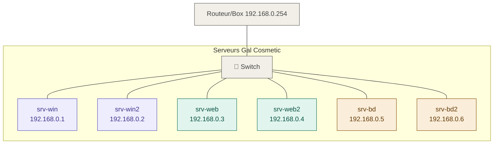
---

<a id="mission1"></a>
# `🧩` ︲ Mission 1 : Préparer le serveur Windows

## `🎯` ︲ Objectif

Renommer le serveur, installer le rôle DNS et configurer le serveur pour qu'il utilise sa propre adresse IP comme serveur DNS.

> [!TIP]
> Pour afficher les captures d'écrans, cliquez sur le menu déroulant avec l'émoji : 📸

## `🛠️` ︲ Étape 1 : Renommer le serveur

1. Ouvrir le `Gestionnaire de serveur` si celui ci ne l'est pas déjà.
2. Aller dans `Serveur local`.
3. Cliquer sur le nom actuel du serveur.
4. Dans l'onglet `Nom de l'ordinateur`, cliquer sur `Modifier`.
5. Saisir le nouveau nom : `srv-win`.
6. Redémarrer le serveur pour appliquer le changement.

<details>
  <summary><strong>📸︲Renommage du serveur</strong></summary>
  
  <br>
  
</details>

## `🛠️` ︲ Étape 2 : Installer le rôle DNS

1. Se rendre dans le `Gestionnaire de serveur`.
2. Cliquer sur `Gérer` puis `Ajouter des rôles et fonctionnalités`.
3. Sélectionner `Installation basée sur un rôle ou une fonctionnalité`.
4. Choisir le `serveur local`.
5. Cocher le rôle `Serveur DNS`.
6. `Valider` et lancer l'installation.

<details>
  <summary><strong>📸︲Installation du rôle DNS</strong></summary>
  
  <br>
  
</details>

## `🛠️` ︲ Étape 3 : Configurer l'adresse IP du serveur DNS

Dans la configuration réseau du serveur, il faut indiquer `sa propre adresse IP` comme **serveur DNS préféré** :

Pour ce faire, 
1. Dans le `Gestionnaire de serveur` puis cliquer sur l'onglet `Serveur local` dans le menu gauche.
1. Cliquer on `l'IP`.
2. Dans la nouvelle fenêtre qui s'affiche `double cliquer` sur la carte `Ethernet`, puis `Protocole Internet version 4`.
3. Dans la partie `Utiliser l'addresse de serveur DNS suivante :` saisir `192.168.0.1` dans `Serveur DNS préféré`. 

<details>
  <summary><strong>📸︲Configuration DNS</strong></summary>
  
</details>

## `🛠️` ︲ Étape 4 : Ajouter l'option DNS dans le service DHCP

Afin que les clients reçoivent automatiquement l'adresse du serveur DNS :

1. Ouvrir la console `DHCP`, pour ce faire dans le `Gestionnaire de Serveur` cliquer sur `Outils` puis `DHCP`.
2. Aller dans `win-srv` → `IPv4` → `Étendue [192.168.0.0] Réseau local` puis `Options d'étendue`.
3. `Clic droit` et `Configurer les options`.
4. Cocher l'option `006 - Serveurs DNS`.
5. `Ajouter` l'adresse IP : `192.168.0.1` puis valider.

<details>
  <summary><strong>📸︲Installation du Service DNS</strong></summary>
  
  <br>
  
  <br>
  
  <br>
  
</details>

## `🛠️` ︲ Étape 5 : Vérification côté client

Sur le client Windows 11 :

1. Ouvrir une `Invite de commandes`.
2. Renouveler l'adresse IP :

```cmd
ipconfig /release
```
et 
```cmd
ipconfig /renew
```

3. Vérifier que le serveur DNS est bien `192.168.0.1` avec la commande:

```cmd
ipconfig /all
```

<details>
  <summary><strong>📸︲Vérification</strong></summary>
  
</details>

---

<a id="mission2"></a>
# `🧩` ︲ Mission 2 : Préparer le serveur Web

## `🎯` ︲ Objectif

Démarrer le serveur Web et lui attribuer une adresse IP statique conforme au schéma réseau.

---

## `🛠️` ︲ Procédure

1. **Démarrer** la VM `srv-web`.
2. Identifier son adresse IP actuelle (attribuée dynamiquement par le DHCP) :

```bash
ip a
```


3. **Modifier l'adressage** pour passer en IP statique :

| Paramètre  | Valeur          |
| ---------- | --------------- |
| Adresse IP | `192.168.0.3`   |
| Masque     | `255.255.255.0` |
| DNS        | `192.168.0.1`   |

Pour ce faire :

```bash
sudo nano /etc/network/interfaces
```

Observer la ligne `iface eth0 inet dhcp` puis remplacer et ajouter :

```bash
iface eth0 inet static
address 192.168.0.3
netmask 255.255.255.0
dns-nameservers 192.168.0.1
```
Puis redémarrer avec :
```bash
sudo reboot
```
<details>
  <summary><strong>📸︲Identification de l'IP</strong></summary>
  
</details>

<details>
  <summary><strong>📸︲Configuration IP statique du serveur Web</strong></summary>
  
  <br>
  
</details>

---

<a id="mission3"></a>
# `🧩` ︲ Mission 3 : Tester le fonctionnement du serveur Web

## `🎯` ︲ Objectif

Vérifier la communication entre le client et le serveur Web, et observer le comportement du DNS via Wireshark.

---

## `🛠️` ︲ Étape 1 : Test de ping

Depuis le client Windows 11, exécuter :

```cmd
ping 192.168.0.3
```

Le ping doit aboutir, confirmant la communication réseau entre les deux machines.

<details>
  <summary><strong>📸︲Ping vers le serveur Web</strong></summary>
  
</details>

---

## `🛠️` ︲ Étape 2 : Accès via navigateur (par IP)

Sur le client, ouvrir un navigateur et saisir :

```text
http://192.168.0.3
```

👉 La page d'accueil du serveur Web doit s'afficher.

<details>
  <summary><strong>📸︲Page d'accueil du serveur Web (accès par IP)</strong></summary>
  
</details>

---

## `🛠️` ︲ Étape 3 : Capture Wireshark sur le port 53

1. Ouvrir **Wireshark** sur le client Windows 11.
2. Démarrer une capture sur l'interface **Ethernet** avec le filtre :

```text
port 53
```

3. Dans un navigateur, accéder à :

```text
http://srv-web.galcosmetic.fr
```

4. Stopper la capture et repérer la première trame **DNS query**.
5. Observer le champ **Domain Name System**.
6. Faire un `clic droit` sur l'attribut **Transaction ID** → `Appliquer comme un filtre` → `Sélectionné`.

### Analyse des trames DNS

| Trame            | Rôle                                                            |
| ---------------- | --------------------------------------------------------------- |
| **DNS Query**    | Le client demande l'IP correspondant à `srv-web.galcosmetic.fr` |
| **DNS Response** | Le serveur DNS répond avec l'adresse IP `192.168.0.3`           |

> [!NOTE]
> **Le port 53** est le port standard utilisé par le protocole DNS pour la résolution de noms de domaine (en UDP pour les requêtes classiques, en TCP pour les transferts de zone).

<details>
  <summary><strong>📸︲Capture Wireshark port 53</strong></summary>
  
  <br>
  
  <br>
  
  <br>
  
  <br>
  
</details>

---

<a id="mission4"></a>
# `🧩` ︲ Mission 4 : Configurer le service DNS


## `🎯` ︲ Objectif

Créer les zones de recherche directe et inversée pour le domaine `galcosmetic.fr`.

---

## `🛠️` ︲ Étape 1 : Créer la zone de recherche directe

1. Ouvrir le `Gestionnaire de serveur` puis `Outils` et `DNS`.
2. `Clic droit` sur `Zones de recherche directes` puis `Nouvelle zone`.
3. Choisir `Zone principale`.
4. Saisir le nom de zone : `galcosmetic.fr`
5. Laisser l'option de `création automatique du fichier de zone` cochée.
6. `Terminer` l'assistant.

<details>
  <summary><strong>📸︲Création de la zone de recherche directe</strong></summary>
  
  <br>
  
  <br>
  
  <br>
  
</details>

---

## `🛠️` ︲ Étape 2 : Créer la zone de recherche inversée

1. `Clic droit` sur **`Zones de recherche inversées`** → **`Nouvelle zone`**.
2. Choisir **`Zone principale`**.
3. Saisir l'**ID réseau** : `192.168.0`
4. Laisser l'option de **création automatique du fichier de zone** cochée.
5. **Terminer** l'assistant.

<details>
  <summary><strong>📸︲Création de la zone de recherche inversée</strong></summary>
  
  <br>
  
  <br>
  
  <br>
  
  <br>
  
  <br>
  
</details>

---

<a id="mission5"></a>
# `🧩` ︲ Mission 5 : Créer des hôtes et tester leur fonctionnement

## `🎯` ︲ Objectif

Créer les enregistrements d'hôtes (A) pour les serveurs Web et valider la résolution DNS (directe et inverse) entre le serveur et le client.

---

## `🛠️` ︲ Étape 1 : Création d'hôtes pour les serveurs Web

1. Ouvrir le **Gestionnaire DNS** sur le serveur `srv-win`.
2. Développer les **Zones de recherche directes** et faire un `clic droit` sur `galcosmetic.fr`.
3. Sélectionner **Nouvel hôte (A ou AAAA)...**.
4. Dans la fenêtre qui s'affiche, saisir :
   - Nom : `srv-web` (le nom de domaine complet (FQDN) sera `srv-web.galcosmetic.fr.`)
   - Adresse IP : `192.168.0.3`
5. Laisser cochée l'option **Créer un pointeur d'enregistrement (PTR) associé**.
6. Cliquer sur **Ajouter un hôte**.

> [!NOTE]
> **FQDN (Fully Qualified Domain Name)** : Un nom de domaine complet qui indique la position absolue du nœud dans l'arborescence DNS.
> **PTR (Pointer Record)** : C'est l'enregistrement de la zone inversée qui permet de trouver le nom d'un hôte à partir de son adresse IP.

<details>
  <summary><strong>📸︲Création de l'hôte srv-web</strong></summary>
  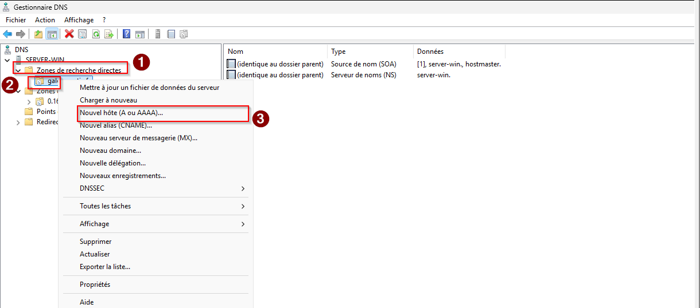
  <br>
  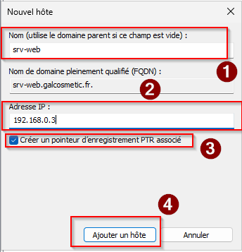
</details>
<details>
  <summary><strong>📸︲Confirmation de la création de l'hôte srv-web</strong></summary>
  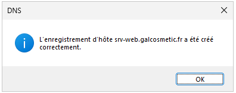
</details>

---

## `🛠️` ︲ Étape 2 : Tests de résolution locale depuis le serveur

Sur `srv-win`, ouvrir une invite de commandes et lancer le test de résolution :

```cmd
nslookup srv-web.galcosmetic.fr
```

>[!NOTE]
> Le **serveur par défaut** (192.168.0.1) répond à la requête et renvoie l'adresse IP associée (`192.168.0.3`). La résolution DNS locale fonctionne.

<details>
  <summary><strong>📸︲Test nslookup (Serveur)</strong></summary>
  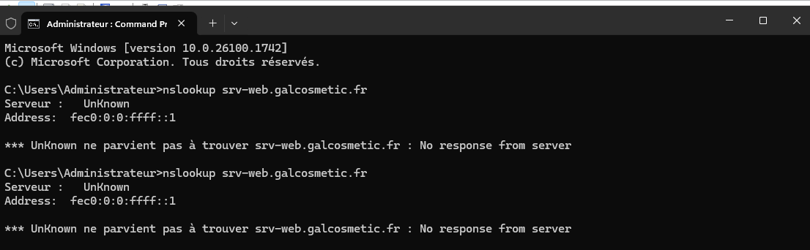
</details>

---

## `🛠️` ︲ Étape 3 : Tests de connectivité et DNS depuis le client

Depuis le client **Windows 11** :

1. Tester la résolution de nom avec `nslookup` :

```cmd
nslookup srv-web.galcosmetic.fr
```

>[!NOTE]
> C'est bien `srv-win` (`192.168.0.1`) qui est interrogé et qui fournit la bonne IP.

<details>
<summary><strong>📸︲Test nslookup (Client)</strong></summary>
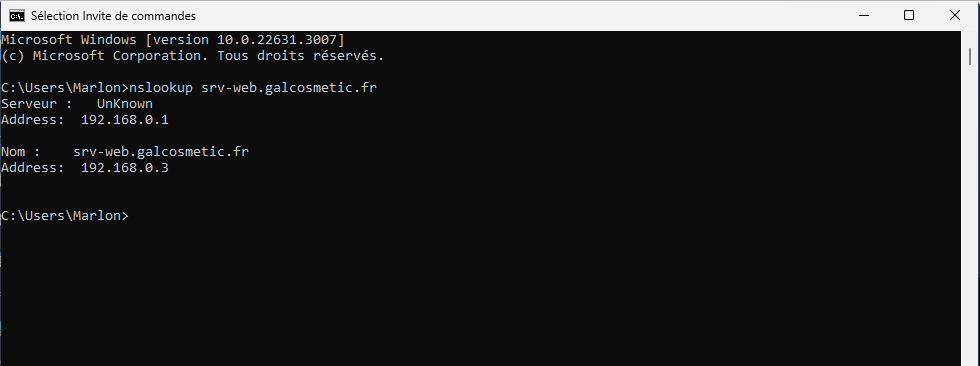
</details>

---

2. Sur Wireshark, démarrer une capture sur l'interface Ethernet du poste client. sur le port `53`.
3. Dans un **navigateur web**, accéder au site via son FQDN :
```text
http://srv-web.galcosmetic.fr
```
4. Arrêter la capture et repérer la première trame `DNS query`. Observer le champ `Domain Name System`. et faire un `clic droit` sur l'attribut `Transaction ID`, sélectionné `Appliquer comme un filtre` puis `Sélectionné`

<details>
  <summary><strong>📸︲Lancement capture Wireshark</strong></summary>
  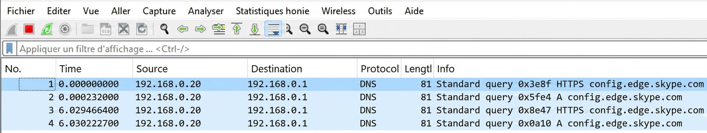
</details>

<details>
  <summary><strong>📸︲Accès au site via FQDN</strong></summary>
  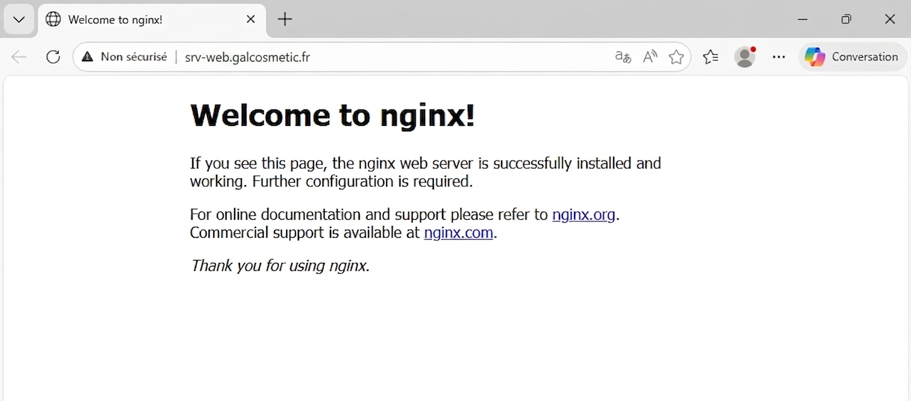
</details>

<details>
  <summary><strong>📸︲Arrêt de la capture Wireshark</strong></summary>
  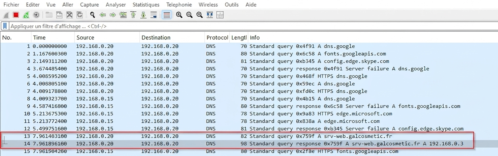
</details>

---

## `🛠️` ︲ Étape 4 : Test de ping entre les machines

1. Tester le ping vers le serveur web `srv-web.galcosmetic.fr` avec le FQDN :

```cmd
ping srv-web.galcosmetic.fr
```

> [!NOTE]
> Nous obtenons cette réponse grâce à la configuration de la zone de recherche directe dans laquelle l'hote à été associé au nom de domaine.

<details>
  <summary><strong>📸︲Test ping (Client)</strong></summary>
  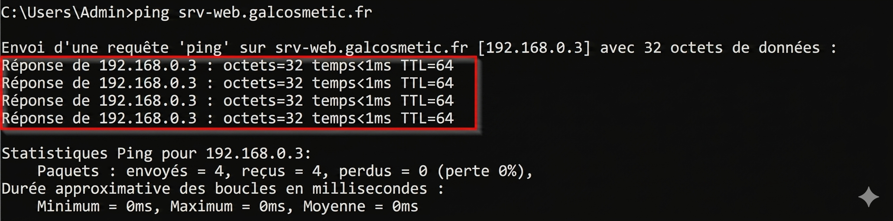
</details>

---

1. Tester le ping vers le serveur `srv-web` avec son adresse IP et l'option `-a` :

```cmd
ping -a 192.168.0.3
```

> [!NOTE]
> Nous obtenons cette réponse grâce à la configuration des enregistrements DNS `A` et `PTR`.

> [!NOTE]
> La commande ping -a 192.168.0.3 permet de tester la connectivité vers le serveur Web et de résoudre son nom d’hôte à partir de son adresse IP, en utilisant le DNS

<details>
  <summary><strong>📸︲Test ping (Client)</strong></summary>
  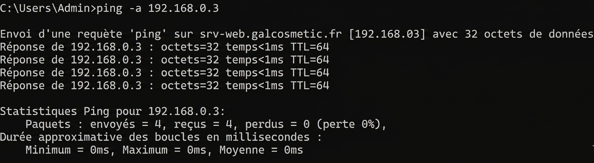
</details>

---

<a id="mission6"></a>
# `🧩` ︲ Mission 6 : Créer des alias (CNAME)

## `🎯` ︲ Objectif

Créer des alias permettant d'accéder au même serveur web avec différents noms (`www` et `spike`).

---

## `🛠️` ︲ Étape 1 : Création des alias CNAME

1. Dans le **Gestionnaire DNS**, faire un `clic droit` sur la zone `galcosmetic.fr` et sélectionner **Nouvel alias (CNAME)**.
2. Pour le premier alias :
   - Nom de l'alias : `www`
   - Nom de domaine complet (FQDN) de l'hôte cible : `srv-web.galcosmetic.fr`
3. Répéter l'opération pour l'alias `spike` pointant vers la même cible.

<details>
  <summary><strong>📸︲Création des alias CNAME (www)</strong></summary>
  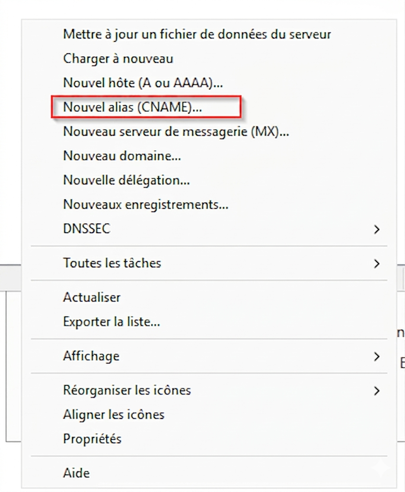
  <br>
  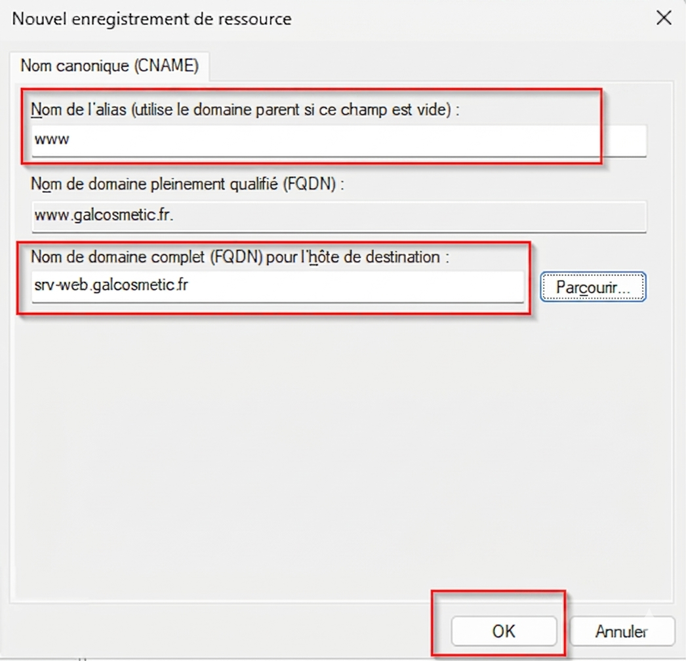
</details>

<details>
  <summary><strong>📸︲Création des alias CNAME (spike)</strong></summary>
  
  <br>
  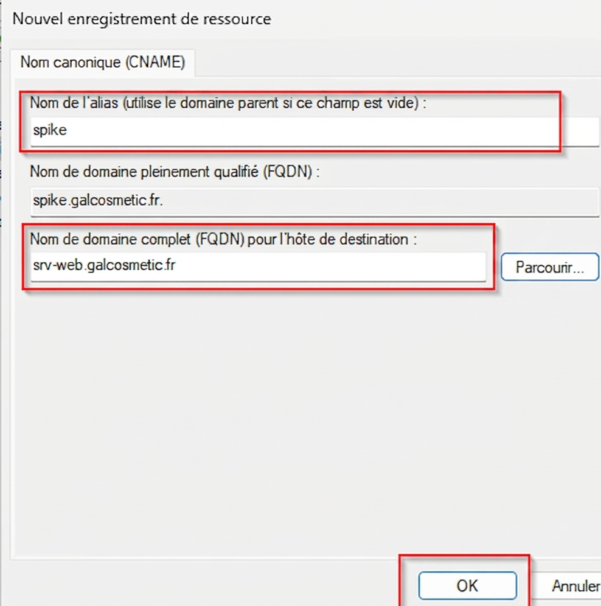
</details>

---

## `🛠️` ︲ Étape 2 : Vérification via navigateur

Sur le client Windows 11 :

1. Démarrer une capture sur Wireshark sur le port `53`.
2. Ouvrir le navigateur et saisir `http://www.galcosmetic.fr`.
3. Si l'on observe la capture Wireshark correspondante, la requête DNS demande `www.galcosmetic.fr`. Le serveur DNS répond avec le CNAME indiquant que le nom canonique est `srv-web.galcosmetic.fr`.
4. Faire de même pour `http://spike.galcosmetic.fr`.
   
<details>
  <summary><strong>📸︲Test Alias (www)</strong></summary>
  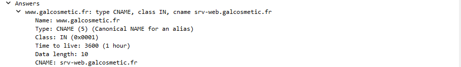
  <br>
  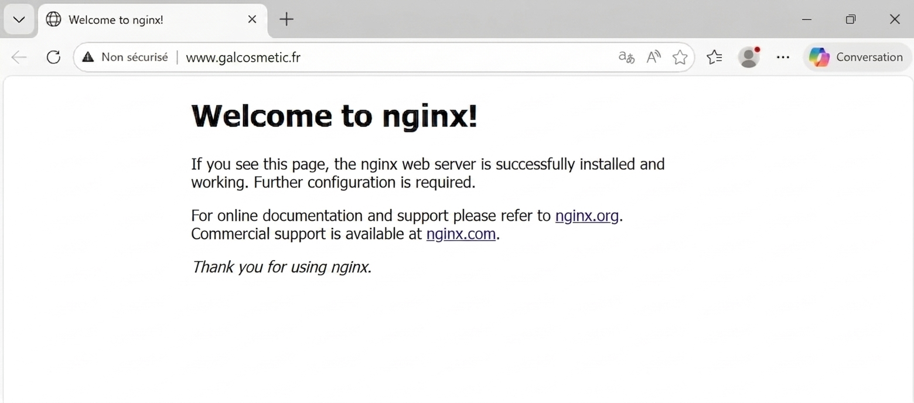
</details>

<details>
  <summary><strong>📸︲Test Alias (spike)</strong></summary>
  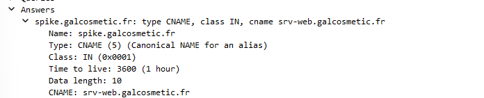
  <br>
  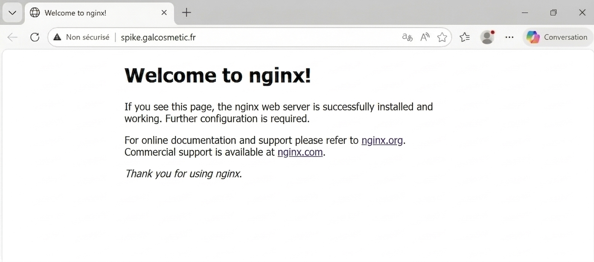
</details>

---

<a id="mission7"></a>
# `🧩` ︲ Mission 7 : Observer et analyser le fichier de configuration DNS

## `🎯` ︲ Objectif

Observer physiquement la structure d'un fichier de zone sur le serveur Windows.

---

## `🛠️` ︲ Procédure

1. Sur `srv-win`, se rendre dans le répertoire système : `C:\Windows\System32\dns`.
2. Ouvrir le fichier de zone `galcosmetic.fr.dns` avec le `Bloc-notes`.
3. Analyser le contenu. On y retrouve l'ensemble des enregistrements en mode texte :
   - Le `SOA` (Start Of Authority).
   - Les enregistrements `A` créés précédemment (`srv-web`).
   - Les enregistrements `CNAME` (`www`, `spike`).

<details>
  <summary><strong>📸︲Fichier de zone DNS</strong></summary>
  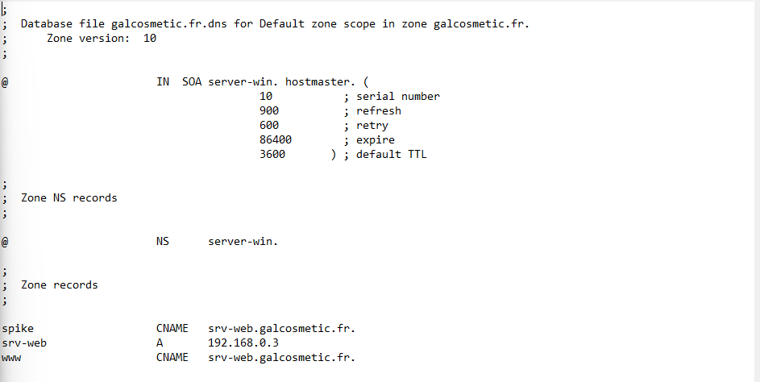
</details>

---

<a id="mission8"></a>
# `🧩` ︲ Mission 8 : Observer le référencement des serveurs racines

## `🎯` ︲ Objectif

Visualiser les serveurs racines par défaut du serveur DNS.

---

## `🛠️` ︲ Procédure

1. Dans le **Gestionnaire DNS**, faire un `clic droit` sur le nom du serveur `srv-win` et cliquer sur **Propriétés**.
2. Se rendre dans l'onglet **Indications de racine**.
3. On y retrouve la liste des 13 serveurs racines mondiaux (nommés de `a.root-servers.net` à `m.root-servers.net`) contenant les informations pour les domaines de premier niveau (TLD).

> [!NOTE]
>Les serveurs racine sont le point de départ de la résolution DNS : ils indiquent au serveur DNS (ou résolveur) vers quels serveurs de domaine de premier niveau (TLD) aller (.com, .fr, etc.).
>La racine DNS est représentée par le point . (Souvent implicite) à la fin d’un FQDN, par exemple example.com.

<details>
  <summary><strong>📸︲Indications de racine</strong></summary>
  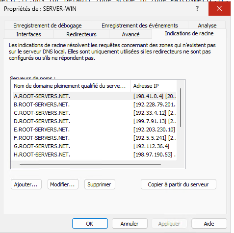
</details>

---

<a id="mission9"></a>
# `🧩` ︲ Mission 9 : Configurer un redirecteur DNS

## `🎯` ︲ Objectif

Permettre au serveur de résoudre des noms de domaines externes (Internet) en transmettant les requêtes inconnues à un autre serveur DNS.

---

## `🛠️` ︲ Procédure

1. Toujours dans les `Propriétés` du serveur `srv-win`, aller dans l'onglet `Redirecteurs`.
2. Cliquer sur `Modifier` et ajouter l'adresse IP d'un DNS public (ex: l'IP du routeur).

<details>
  <summary><strong>📸︲Configuration d'un redirecteur</strong></summary>
  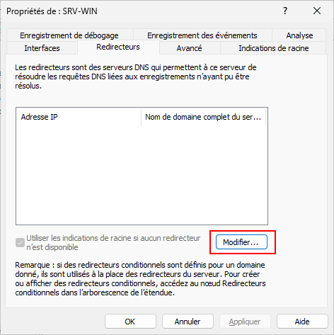
  <br/>
  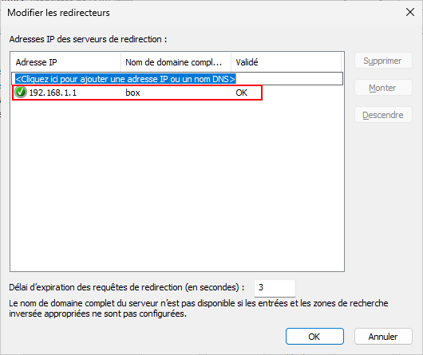
</details>

---

<a id="mission11"></a>
# `🧩` ︲ Mission 11 : Louer un nom de domaine

## `🎯` ︲ Objectif

Comprendre l'utilité d'un Bureau d'enregistrement.

---

## `🛠️` ︲ Comparatif des registrars

| Fournisseur   | Atouts                                                                                                                       |
| :------------ | :--------------------------------------------------------------------------------------------------------------------------- |
| **OVHcloud**  | Leader FR, idéal pour Gal Cosmetic. Domaine .fr/.com à tarif compétitif, remises la 1re année.                               |
| **Gandi.net** | Expertise et respect de la vie privée. Prix corrects à l’achat, mais renouvellements parfois plus élevés que la moyenne.     |
| **Namecheap** | Interface simple et tarifs d'appel bas. Bien pour payer peu la 1re année, mais les renouvellements peuvent coûter plus cher. |

---

<a id="mission12"></a>
# `🧩` ︲ Mission 12 : Identifier les adresses IP de serveurs

## `🎯` ︲ Objectif

Utiliser la commande `host` pour identifier les IP ou DNS faisant autorité sur un domaine précis.

---

## `🛠️` ︲ Procédure

Dans un environnement Linux, la commande `host` permet d'interroger directement les serveurs DNS. L'option `-t ns` permet de lister les **Name Servers**.

Exemple d'utilisation :
```bash
host -t A www.galcosmetic.fr
```
afin de retourner l'ip du serveur web `www.galcosmetic.fr`.

<details>
  <summary><strong>📸︲Enregistrements NS</strong></summary>
  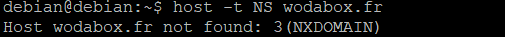
  <br/>
  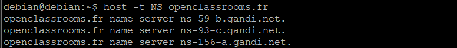
  <br/>
  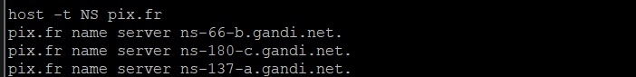
  <br/>
  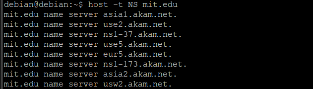
</details>

<details>
  <summary><strong>📸︲Enregistrements SOA</strong></summary>
  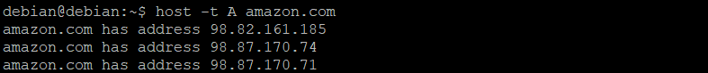
  <br/>
  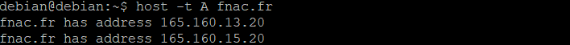
  <br/>
  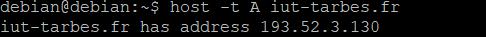
  <br/>
  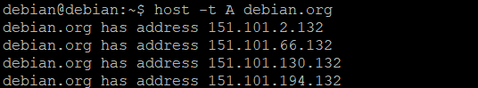
</details>
---


<a id="concepts-dns"></a>
# `📖` ︲ Concepts DNS

## `🔍` ︲ Rôles des zones Directe et Inversée

*   **Zone de recherche directe** : C'est le rôle principal du DNS. Elle permet de traduire un nom d'hôte (FQDN) en une adresse IP. Par exemple, lorsqu'un utilisateur saisit `srv-web.galcosmetic.fr`, le DNS interroge la zone directe pour renvoyer l'IP `192.168.0.3`.
*   **Zone de recherche inversée** : Elle effectue l'opération inverse en traduisant une adresse IP en un nom d'hôte. Elle est essentielle pour certains protocoles de sécurité, pour le diagnostic réseau (ex: `ping -a`) et pour éviter que les emails ne soient considérés comme spams.

## `🏷️` ︲ Signification des termes techniques

*   **SOA (Start Of Authority)** : L'enregistrement de "début d'autorité". Il s'agit de l'enregistrement le plus important d'une zone. Il désigne le serveur DNS principal qui détient les informations de la zone et contient des paramètres de gestion comme le numéro de série (utilisé pour la réplication vers les serveurs secondaires) et les durées de cache (TTL).
*   **NS (Name Server)** : Cet enregistrement liste les serveurs DNS qui font autorité pour le domaine. Il indique quel(s) serveur(s) possède(nt) les fichiers de zone et peuvent répondre aux requêtes concernant ce domaine.

---

**Esteban GUILLERMIN EGIDIO** | **BTS SIO SISR**
